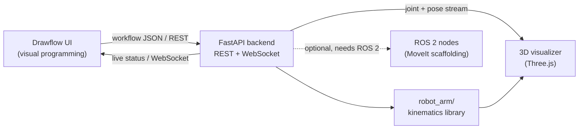
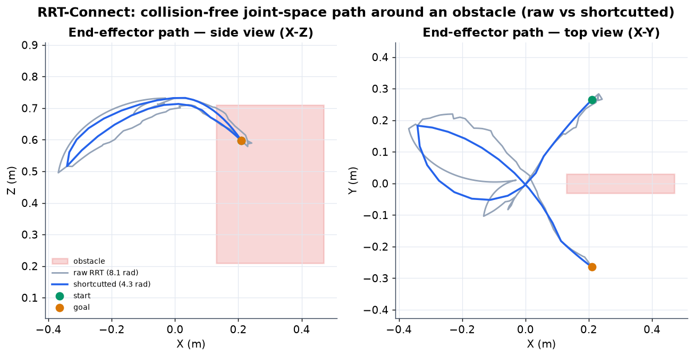
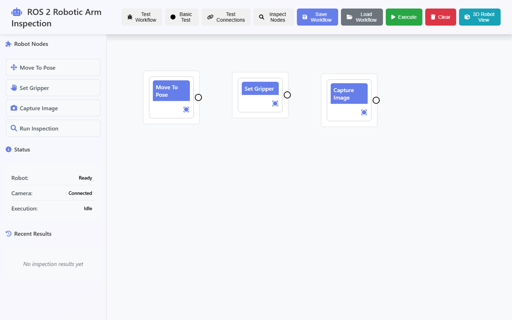
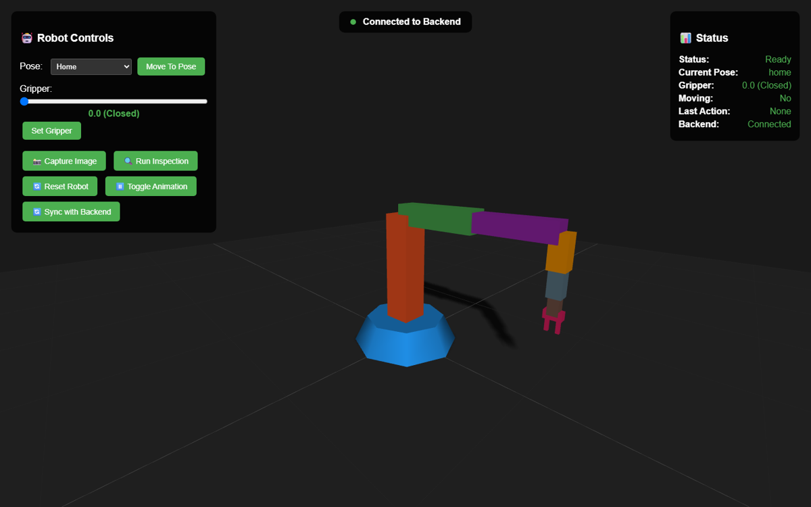

# Robotic Arm Inspection Workcell Simulation

[](https://github.com/earosenfeld/ros2-robotic-arm/actions/workflows/ci.yml)

A **simulation of a robotic-arm inspection workcell**: a browser-based
visual-programming UI for building inspection routines, a 3D Three.js view of a
6-DOF arm, and a FastAPI backend that executes the routines — now backed by a
**real, tested pure-Python kinematics library** parsed from the robot's URDF.

It is a teaching / demonstration project, not a driver for physical hardware.
The kinematics, trajectory, and **collision-aware RRT-Connect motion planning**
are real and unit-tested; the ROS 2 / MoveIt execution layer is scaffolding; the
robot itself is mocked. See
**[What's real vs simulated](#whats-real-vs-simulated)**.

---

## Architecture



- **Drawflow UI** (`drawflow_ui/`) — drag-and-drop nodes (MoveToPose,
  SetGripper, CaptureImage, RunInspection) wired into inspection workflows.
- **FastAPI backend** (`backend/`) — REST endpoints + a WebSocket status stream
  that execute workflows and broadcast robot state.
- **Kinematics library** (`robot_arm/`) — forward/inverse kinematics, Jacobian,
  and trajectory generation (see below).
- **3D visualizer** (`drawflow_ui/robot_visualizer.html`) — Three.js rendering
  of the arm, animated from the backend's joint/pose stream.
- **ROS 2 nodes** (`ros2_nodes/`) — optional MoveIt / RealSense scaffolding for
  a future real-hardware path.

---

## Kinematics library

`robot_arm/` is a dependency-light (NumPy only) kinematics package built
directly from the joint geometry in `urdf/robot_arm.urdf`:

- **Forward kinematics** — joint angles to end-effector pose via the URDF link
  chain.
- **Geometric Jacobian** — maps joint velocities to end-effector linear and
  angular velocity.
- **Inverse kinematics** — damped-least-squares (Levenberg–Marquardt style)
  solver that stays stable near singularities.
- **Trajectory generation** — quintic (smooth position/velocity/acceleration)
  and trapezoidal-velocity profiles.

Everything is validated by a **pytest suite** in `tests/` that parses the URDF
and checks FK against known poses, FK/Jacobian consistency, IK convergence and
round-trip accuracy, and trajectory boundary/continuity conditions.

### Figures

Generated by `scripts/make_figures.py`:


---

## Motion planning

`robot_arm/planning.py` adds a **collision-aware RRT-Connect** planner so the
arm can route around obstacles on its own — not just follow a commanded
trajectory. It is pure-Python (NumPy only) and ROS-free, like the rest of
`robot_arm/`.

- **Collision model** — obstacles are spheres (`Sphere`) and axis-aligned boxes
  (`Box`). Each arm link is approximated by sample points along the capsule
  centerlines between consecutive link frames (from
  `RobotKinematics.link_frames(q)`), interpolated so a thin obstacle wedged
  between two joints is still caught. `in_collision(q, obstacles)` is `True`
  when any sample lies within a link radius + safety margin of an obstacle.
- **RRT-Connect** — `rrt_connect(q_start, q_goal, obstacles, joint_limits, …)`
  grows two trees (one from the start, one from the goal) in joint space. Each
  iteration samples a random valid configuration, extends the active tree one
  `step` toward it, then greedily *connects* the other tree to that new node;
  the trees swap every iteration. Joint limits are respected by construction and
  every tree edge is collision-checked at a fine resolution, so an accepted edge
  is genuinely traversable. It returns the joint path (or `None` if no path is
  found within `max_iters`).
- **Shortcutting** — `shortcut_path(path, obstacles)` repeatedly replaces a
  random sub-path with the straight joint-space chord when that chord is
  collision-free. By the triangle inequality this never increases joint-space
  path length, and the result stays collision-free.
- **Entry points** — `plan_to_config(q_start, q_goal, obstacles)` plans then
  shortcuts; `plan_to_pose(q_start, target_pose, obstacles)` runs IK to turn a
  Cartesian goal into a joint goal first.

The planner is validated by `tests/test_planning.py`: it finds a collision-free
path around a blocking wall (endpoints preserved, every config within limits,
collision-free under dense resampling), returns `None` when the goal is enclosed
(no false success), shortcuts without lengthening the path, and is deterministic
under a fixed seed.



---

## The workcell UI

Visual-programming workbench (Drawflow) with live backend status, and the
Three.js robot visualizer streaming joint state over WebSocket:





---

## Running it

Full instructions are in **[SETUP_GUIDE.md](SETUP_GUIDE.md)**. The short version:

**Web demo** (Drawflow UI + 3D viz + FastAPI backend):

```bash
python3 -m venv .venv && source .venv/bin/activate
pip install -r requirements.txt
./start_system.sh            # serves UI on :8080, API on :8000
```

Then open http://localhost:8080 (UI) and
http://localhost:8080/robot_visualizer.html (3D view).

**Kinematics tests**:

```bash
pip install numpy pytest matplotlib
python -m pytest tests/ -q
```

---

## What's real vs simulated

| Layer | Status |
|-------|--------|
| **Kinematics & trajectories** (`robot_arm/`) | **Real and unit-tested** — FK, Jacobian, damped-least-squares IK, quintic/trapezoidal trajectories, validated by `tests/`. |
| **Motion planning** (`robot_arm/planning.py`) | **Real and unit-tested** — collision-aware RRT-Connect in joint space, capsule-based collision checking, and path shortcutting, validated by `tests/test_planning.py`. |
| Visual programming UI + FastAPI backend | **Real software** — the Drawflow UI, REST/WebSocket API, and 3D viz run as shown. |
| ROS 2 / MoveIt motion execution (`ros2_nodes/`) | **Scaffolding** — requires a ROS 2 + MoveIt install (Humble); not exercised by the demo or CI. To run: source a Humble workspace, `colcon build` this package, then launch from `launch/`. |
| Robot hardware & camera | **Mocked** — movements are simulated with timing delays; inspection results are synthetic; no physical arm or RealSense camera is driven. |

---

## Project layout

```
ros2-robotic-arm/
├── robot_arm/        # Pure-Python library: kinematics (FK, IK, Jacobian), trajectories, RRT-Connect planning
├── tests/            # pytest suite for the kinematics + planning library
├── scripts/          # make_figures.py — generates the README figures
├── urdf/             # robot_arm.urdf — joint geometry (source of truth for kinematics)
├── ros2_nodes/       # ROS 2 / MoveIt node scaffolding (optional)
├── backend/          # FastAPI backend (REST + WebSocket)
│                     #   main_simple.py — standalone sim backend (no ROS; used by start_system.sh)
│                     #   main.py        — rclpy-backed variant (requires a ROS 2 Humble env)
├── drawflow_ui/      # Drawflow UI + Three.js 3D visualizer
├── assets/           # Generated figures
├── config/ launch/   # ROS 2 config and launch files
└── package.xml / CMakeLists.txt   # ROS 2 package metadata
```

---

## Continuous integration

`.github/workflows/ci.yml` runs the kinematics test suite on Python
3.10 / 3.11 / 3.12. The ROS 2 nodes are **not** built in CI (they require a
full ROS 2 + MoveIt environment); the kinematics library is the CI-tested core.

---

## License

MIT — see [LICENSE](LICENSE).
